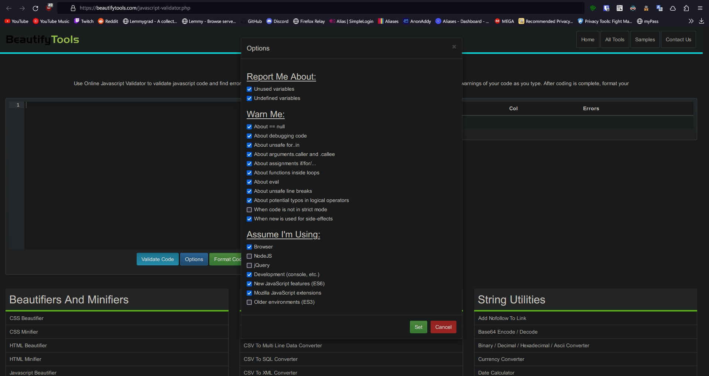
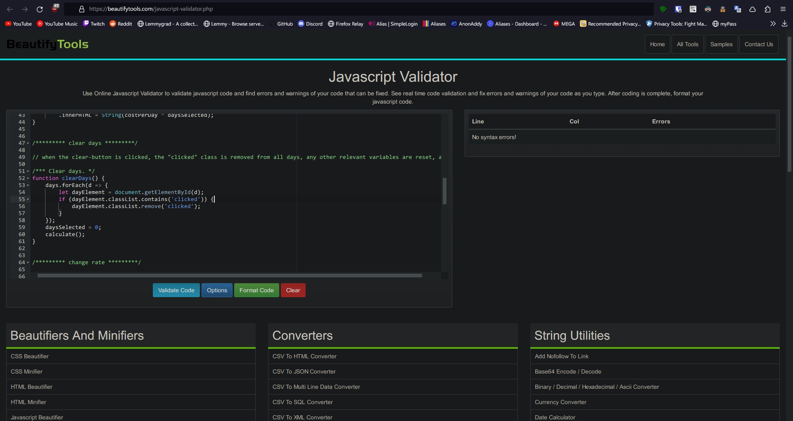
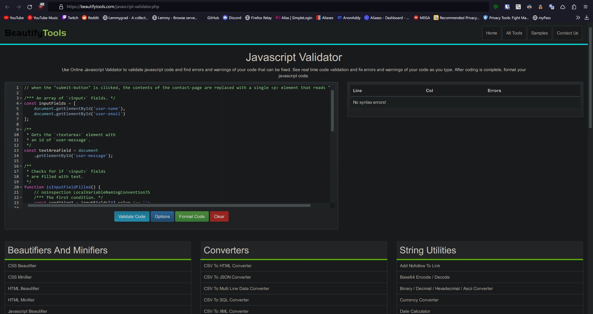
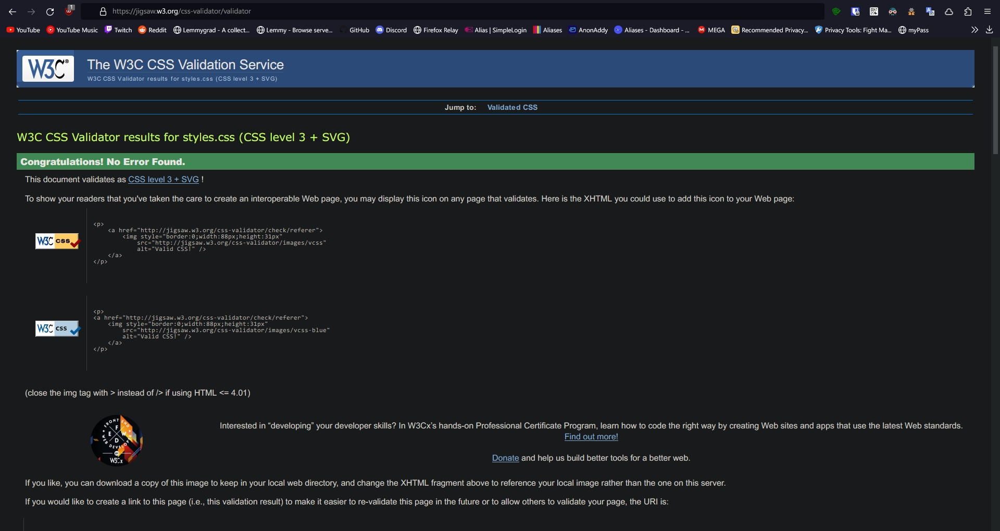

# Assignment 3

## JavaScript Validation Screenshots

_The default settings were changed to accommodate for the JS source code that makes use of features that are exclusive to JS **v6**._

--------

## CSS Validation Screenshots

_NOTE: The default setting were used for this CSS validation._

